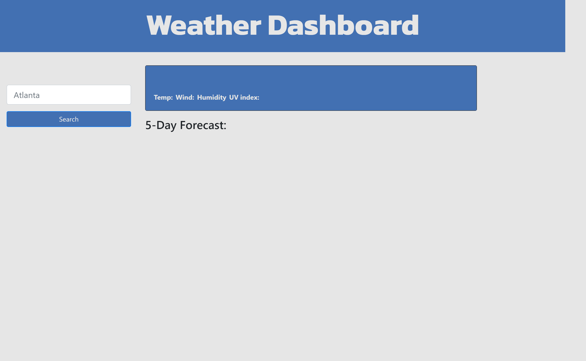
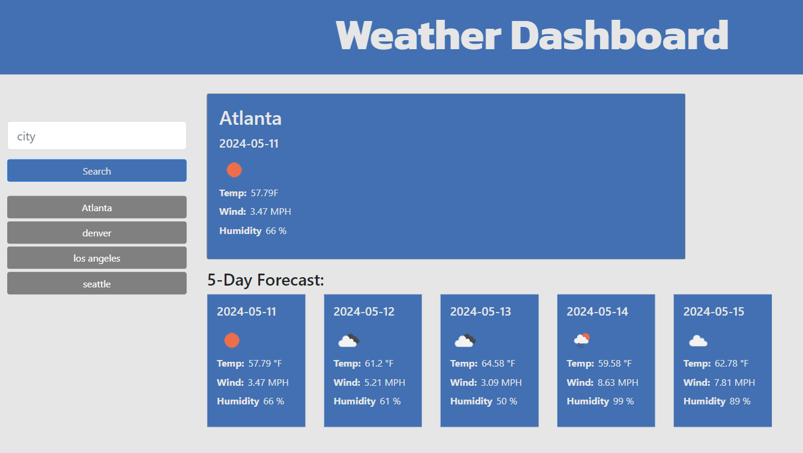

# weather-dashboard

A simple web application that allows users to search for a city to get the current weather and 5 day forecast. Cities that users previously looked up will be saved in their local storage.

## Description

This weather dashboard allows users to search for a city to get the current weather and 5 day forecast. It will display the the city name, the date, an icon representation of weather conditions, the temperature, the humidity and the wind speed. it also has a 5-day forecast that displays the date, an icon representation of weather conditions, the temperature, and the humidity for next 5 days. The search history or the names of the city's you searched for  will be saved in local storage and automatically populated as buttonns in the UI. You can simply press these city buttons to get forecast data for those cities.

The following animation demonstrates the application functionality: 

## Getting Started
The application can be simply accesed using the link of the GitHub Pages. The following image demonstrates the web application's appearance:

User can search for a city using the search box input. Then the current value and the 5 day forecast will be displayed in the home section.Also the searched city will now appear as a button below the search button. The page will look like the following image:

### Dependencies

* none

### Installing

* No installation required. The application is deployed using GitHub Pages

### Executing program

* The application can accesed directly using the link:
[GitHubPage-weatherboard](https://aniraannu.github.io/weather-dashboard/)

## Help

NA

## Authors

Contributors names and contact info

Anira Raveendran
[@aniraannu](https://github.com/aniraannu)

## Version History

* 0.1
    * Initial Release

## License

None

## Acknowledgments

Inspiration, code snippets, etc.

* [dbader](https://github.com/dbader/readme-template)
